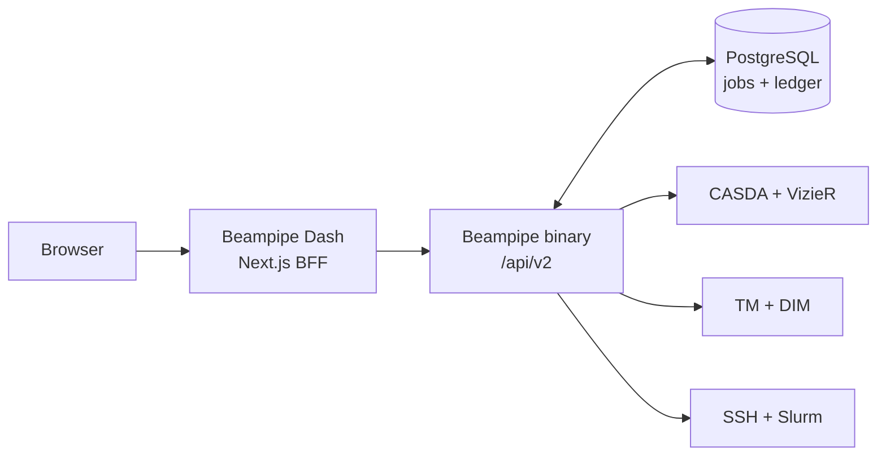

# Beampipe Dash

Beampipe Dash is the operator web interface for Beampipe v2. It provides one place to configure projects and deployment targets, operate discovery and execution, and inspect live or historical control-plane state.

The dashboard is a separate process and Git repository. It owns no database and never replaces Beampipe's PostgreSQL ledger.



## Start locally

Beampipe must already be running at `http://127.0.0.1:8080`.

```bash
cp .env.example .env.local
npm ci
npm run dev -- --hostname 127.0.0.1 --port 3000
```

Open `http://127.0.0.1:3000` and sign in with the account created by `beampipe setup`.

## Start with Docker

The default Compose configuration reaches a Beampipe API published on host port `8080`.

```bash
docker compose up --build -d
docker compose ps
```

Open `http://127.0.0.1:3000`. Set `BEAMPIPE_API_URL` before starting Compose when the API uses another address.

## Operator path

1. Create or revise project policy in **Projects**.
2. Create and test a REST or Slurm target in **Profiles**.
3. Register multiple sources and trigger discovery in **Sources**.
4. Watch durable work in **Jobs** and source readiness in the source explorer.
5. Validate metadata and submit one or many sources from **Compose run**.
6. Follow ledger phases, external identities, artifacts, graph state, and provenance in the run explorer.

## Documentation

- [Getting started](docs/getting-started.md)
- [First end-to-end run](docs/operator-workflow.md)
- [Deployment and security](docs/deployment.md)
- [Architecture](docs/architecture.md)
- [Development and browser checks](docs/testing.md)

## Quality gate

```bash
npm run lint
npm run typecheck
npm test
npm run build
```

The browser talks only to the dashboard. Beampipe tokens stay in HttpOnly cookies managed by the server-side BFF, and secret material is never accepted by project or deployment-profile forms.
