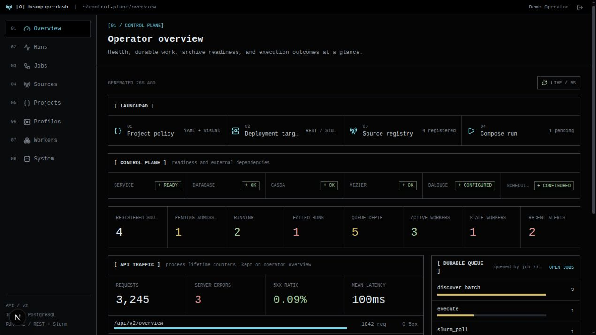
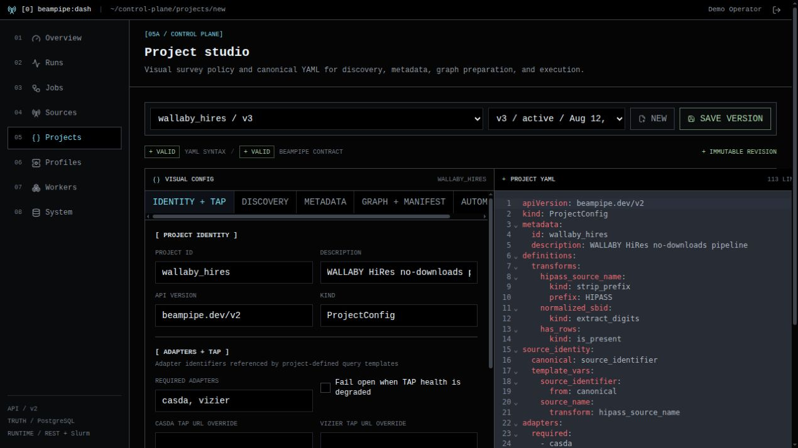

<p align="center">
  
</p>

<p align="center">
  <a href="https://github.com/jbwod/beampipe-dash/actions/workflows/quality.yml"></a>
  <a href="https://github.com/jbwod/beampipe-core-v2"></a>
  
</p>


> `beampipe-dash` is the operator console for [Beampipe Core](https://github.com/jbwod/beampipe-core-v2). The browser talks only to Dash; a same-origin BFF calls Core `/api/v2` and keeps access and refresh tokens in HttpOnly cookies. Dash owns no database, runs no workers, and does not invent workflow state. PostgreSQL remains the ledger.


## `What it does`

> - **`One operator workflow`**: project policy, deployment targets, source registry, compose-run, ledger inspection, jobs, workers, alerts, and system health in one ASCII console.

> - **`Core remains authority`**: every value and mutation maps to `/api/v2`. Dash reports Core readiness, revisions, and executions; it does not reconcile backends or store secrets.

> - **`Immutable authoring`**: project studio and profile editor upload new Core revisions. Existing runs keep the pinned project config and deployment-profile snapshot.

> - **`Private token boundary`**: JavaScript never sees Bearer tokens. Superuser actions (save project, test a webhook, drain a worker) follow Core's auth, not a second permission model.


## `Operator surfaces`

> - **`Overview`**: launchpad plus live readiness, queue depth, workers, API traffic, and recent alerts.

> - **`Projects and profiles`**: visual + canonical `beampipe.dev/v2` YAML, and versioned REST DIM / Slurm targets with connectivity checks.

> - **`Sources and runs`**: register common-IDs, trigger discovery, inspect blockers, compose a batch, then follow control / scheduler / DALiuGE / output axes on the ledger.

> - **`Alerts`**: webhook or SMTP channels, trigger rules, test sends, and redacted deliveries. Secrets stay in Core.

<table>
  <tr>
    <td>
<picture>

</picture>
    </td>
    <td>
<picture>

</picture>
    </td>
  </tr>
</table>


## `Not a second control plane`

> - **`No local ledger`**: sources, jobs, artifacts, and alert deliveries are Core rows. Dash polls and mutates them.

> - **`No credential store`**: SSH keys, TAP passwords, and webhook URLs are configured in Core. Dash omits `[REDACTED]` fields on save unless a new value is typed.

<table>
  <tr>
    <td>
<picture>

</picture>
    </td>
    <td>
      <pre><code>browser
  --> Dash (Next.js BFF)
    --> Core /api/v2
      <--> PostgreSQL ledger

cookies: HttpOnly access + refresh
API URL: server-side only</code></pre>
    </td>
  </tr>
</table>


## `First-time setup`

Start Core first (`beampipe`). Then install Dash; the script finds Core's home, Compose network, and API port:

```bash
curl -fsSL https://raw.githubusercontent.com/jbwod/beampipe-dash/main/scripts/install.sh | sh
```

Or from a checkout:

```bash
git clone https://github.com/jbwod/beampipe-dash.git
cd beampipe-dash
./scripts/install.sh --core-home ~/beampipe
```

That writes `compose.beampipe-local.yml` with `BEAMPIPE_API_URL=http://api:8080` on Core's private network (operator installs are usually `beampipe_default`) and starts the UI on [http://127.0.0.1:3000](http://127.0.0.1:3000). `beampipe setup --dashboard` runs the same installer after Core is up.

**Native Next.js** — Core must already serve `/api/v2` on the host (operator default **18080**):

```bash
cp .env.example .env.local
# BEAMPIPE_API_URL=http://127.0.0.1:18080
npm ci
npm run dev -- --hostname 127.0.0.1 --port 3000
```

Open [http://127.0.0.1:3000](http://127.0.0.1:3000) and sign in with a Core account. Saving projects, profiles, or alert channels requires a superuser. Continue with the [getting started](docs/getting-started.md) guide and Core [first workflow](https://beampipe-core.readthedocs.io/getting-started/first-run/).


## `Runtime`

| Role | How | Scale rule |
|---|---|---|
| Browser UI | `npm run dev` or Compose `dashboard` | one per operator LAN / reverse proxy |
| BFF | same Next.js process, `/api/beampipe/*` | do not publish Core 18080 to that LAN |
| Core API | `beampipe serve` / Compose `api` | Dash is a client; Core still owns jobs |

> - Next.js App Router on Node 24
> - Same-origin proxy to `/api/v2` only; caller `Authorization` headers are discarded
> - Cross-origin mutations rejected; refresh tokens rotate server-side
> - `.env.local` for native Next; `.env` for Compose interpolation


## `Documentation`
https://beampipe.jackblackwood.com


## `Development`

```bash
npm ci
npm run lint
npm run typecheck
npm test
npm run build
```

`npm run mock:api` serves a synthetic Core on `127.0.0.1:18080` for UI work without a live stack.
