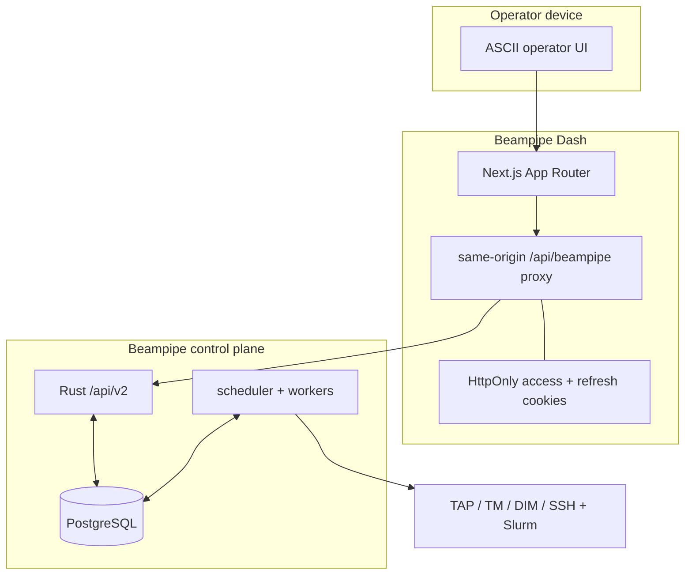
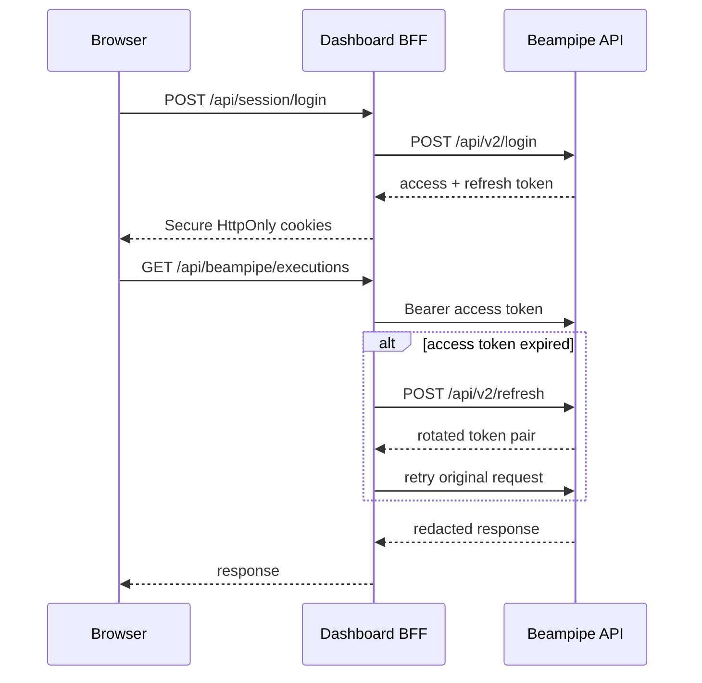

# Dashboard architecture

## Product boundary

Beampipe Dash is an authenticated operator client, not a second control plane. It does not own a database, run schedulers, resolve secrets, or infer ledger transitions. Every state change maps to a Beampipe v2 API operation.

## Authentication

The generic proxy accepts only `/api/v2/*`, discards caller-supplied authorization headers, rejects cross-origin mutations, rotates refresh tokens, and never exposes either token to client JavaScript.

## Data ownership

| Data | Owner | Dashboard behavior |
|---|---|---|
| Users and password hashes | Beampipe | Login and current-user lookup only |
| Project configurations | Beampipe immutable revisions | Visual/YAML authoring and upload |
| Deployment profiles | Beampipe revisioned rows | Typed REST/Slurm CRUD and connectivity checks |
| Sources and archive metadata | Beampipe | Registry CRUD, discovery trigger, readiness inspection |
| Jobs and worker leases | Beampipe | Bounded live polling and privileged scheduler trigger |
| Executions and artifacts | Beampipe ledger | Prepare, create, start, retry, cancel, and inspect |
| SSH keys and external secrets | Beampipe runtime | Readiness only; never accepted or stored |

## Project studio

YAML is canonical. The visual editor and CodeMirror surface operate on one parsed `ProjectConfig` document:

1. A visual change updates an immutable in-memory draft and serializes YAML.
2. A valid YAML change immediately normalizes the visual draft.
3. Invalid YAML remains visible while the last valid visual draft is preserved.
4. Unknown project-specific keys survive normalization and round trips.
5. Saving uploads a new immutable version and displays Beampipe contract diagnostics.

TAP queries remain project-defined. The dashboard does not hardcode CASDA or VizieR ADQL.

## Runtime behavior

- TanStack Query polls live views at bounded 5-30 second intervals.
- Terminal executions stop their detail polling.
- Mutations invalidate only related caches.
- Execution preparation is authoritative; the dashboard does not duplicate archive-readiness rules.
- Deployment forms mirror the strict Rust tagged profile schema.
- Destructive and externally effective operations use confirmation or explicit review gates.

## Current interface map

| Route | Purpose |
|---|---|
| `/overview` | Dependency state, API traffic, queue, workers, latest runs, launchpad |
| `/projects` and `/projects/new` | Project registry and bidirectional visual/YAML studio |
| `/profiles` | REST/Slurm profiles, revisions, scheduler resources, connectivity |
| `/sources` and `/sources/:id` | Registration, discovery, admission, metadata, provenance |
| `/runs/new` | Multi-source preparation, profile pinning, creation, submission |
| `/runs` and `/runs/:id` | Live/history list and full execution ledger explorer |
| `/jobs` | Durable queue, attempts, leases, and errors |
| `/workers` | Worker pools, capabilities, health, and active leases |
| `/system` | Readiness, diagnostics, reconciliation risk, SSH posture |

User creation remains a Beampipe CLI bootstrap operation because the current v2 API has no user-administration routes. The dashboard deliberately does not create a competing credential store.
