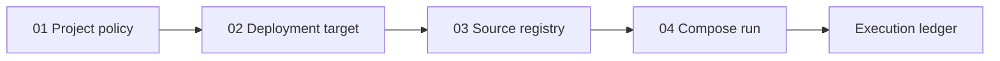

# Getting started

This guide starts the Beampipe binary and dashboard on one machine. PostgreSQL and Beampipe remain prerequisites for the dashboard.

## 1. Start Beampipe

From an initialized Beampipe operator directory:

```bash
beampipe doctor
beampipe start
```

Keep that terminal open. Confirm the API from a second terminal:

```bash
curl -fsS http://127.0.0.1:18080/api/v2/health
```

Expected status is HTTP `200` with a healthy Beampipe service response.

### First account

`beampipe setup` creates the initial administrator during first-run setup. If the database is already configured but no account exists, create one with the binary:

```bash
beampipe admin create-user \
  --username operator \
  --email operator@example.org \
  --name "Beampipe Operator" \
  --password 'replace-this-immediately'
```

Prefer interactive `beampipe setup` on shared systems so a password is not retained in shell history. The current v2 API does not expose user CRUD, so this is the only setup step outside the dashboard.

## 2. Start the dashboard

Prefer the installer, which detects Core and starts Compose:

```bash
curl -fsSL https://raw.githubusercontent.com/jbwod/beampipe-dash/main/scripts/install.sh | sh
# or from a checkout:
./scripts/install.sh --core-home ~/beampipe
```

```text
Beampipe API  http://127.0.0.1:18080  (host publish; containers use http://api:8080)
Dashboard     http://127.0.0.1:3000
```

Open the dashboard URL and sign in. The browser never connects directly to Core.

For a native Next.js process during development:

```bash
cp .env.example .env.local
# BEAMPIPE_API_URL=http://127.0.0.1:18080
npm ci
npm run dev -- --hostname 127.0.0.1 --port 3000
```

## 3. Confirm readiness

Open **System** and confirm:

- service and PostgreSQL are ready;
- CASDA and VizieR health reflect the configured TAP policy;
- DALiuGE and scheduler status match the intended backend;
- at least one worker pool is healthy;
- operator diagnostics have no unresolved critical entry.

For the equivalent binary checks:

```bash
beampipe doctor
beampipe status
beampipe worker list
```

## 4. Build the first workflow

The Overview launchpad follows the dependency order:



Continue with [the end-to-end operator workflow](operator-workflow.md).

## Common startup failures

| Symptom | Check |
|---|---|
| Login says Beampipe is unavailable | `BEAMPIPE_API_URL` is reachable from the dashboard process |
| Login returns 401 | Account exists and password is correct |
| Mutations return 403 behind a proxy | Proxy overwrites `Host`, `X-Forwarded-Host`, and `X-Forwarded-Proto` correctly |
| Session immediately expires over HTTPS | Set `BEAMPIPE_DASH_SECURE_COOKIES=true` |
| Project save or profile edit is disabled | Current account must be a Beampipe superuser |
| Sources never leave discovery | A worker with discovery capability is running; inspect **Jobs** and **Workers** |
