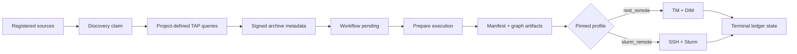

# First end-to-end run

This workflow configures a project, selects an execution backend, discovers multiple sources, and submits one run through the dashboard.

## Data flow



## 1. Project policy

Open **Overview > Project policy**, then choose an existing project or **New**.

The visual editor covers:

- project identity and required adapters;
- TAP timeout/retry policy;
- project-defined discovery queries and enrichments;
- metadata mappings, transforms, flags, and signature fields;
- graph URL or path, manifest templates, and graph patches;
- discovery and execution scheduler policy.

The YAML pane is canonical and updates in both directions. For a GitHub EAGLE graph URL, **Open graph in EAGLE** opens the same graph in the configured editor.

Select **Save version**. A successful save activates a new immutable project revision; contract errors remain above the editor and prevent a valid workflow from being assumed.

## 2. Deployment profile

Open **Deployment target** from the launchpad.

### Local REST example

Create a **REST remote** profile with values matching the running local DALiuGE services:

```text
name                 rest-local
project              wallaby_hires
default              yes
translator URL       http://127.0.0.1:8084
deploy host          127.0.0.1
deploy port          8001
DIM host for TM      127.0.0.1
DIM port for TM      8001
```

When Beampipe itself runs in Docker, use names or addresses reachable from the Beampipe container, not from the browser.

Save the profile, then select **Test**. The result must show a reachable translator and manager before execution.

### Slurm profile

Choose **Slurm remote**, then configure login node, account, absolute remote paths, resources, manager topology, modules, environment, and runtime flags. The **Test** action verifies SSH/Slurm connectivity and renders the effective `#SBATCH` request.

SSH private keys, passphrases, and `known_hosts` remain external Beampipe runtime secrets. The dashboard displays readiness but never receives key material. See [Deployment and security](deployment.md#ssh-and-secrets).

## 3. Register and discover sources

Open **Source registry** and select **Register**.

1. Choose the project.
2. Enter one source identifier per line.
3. Select **Register sources**.
4. Select multiple rows.
5. Select **Discover selected** and confirm.

Discovery runs asynchronously. Follow `scheduler_tick` and `discover_batch` work in **Jobs**. Open an individual source to inspect:

- readiness gates and blockers;
- metadata grouped by SBID;
- current and last-executed discovery signatures;
- linked executions and source provenance;
- enabled and stale-after policy.

A source can be composed manually when **Admission** is ready. With project execution automation enabled, discovery changes also mark the source workflow-pending and recurring admission groups it according to project policy.

## 4. Compose multiple sources

Select same-project sources and choose **Compose run**, or open **Runs > Compose run**.

1. Confirm the project, archive, and deployment profile revision.
2. Select one or more source rows.
3. Select **Validate selection**.
4. Review source, SBID, and dataset counts.
5. Resolve every blocker before continuing.
6. Keep **Start immediately**, **Stage inputs**, and **Submit backend** enabled for the full flow.
7. Select **Create + start**.

Preparation calls Beampipe's authoritative readiness endpoint. Any source change invalidates the preview and requires another validation. Creation pins the active project revision and deployment profile snapshot to the execution ledger.

## 5. Follow the run

The run explorer is the complete evidence view:

| Tab | Evidence |
|---|---|
| Overview | Three state axes, source inputs, phase timing, backend identity |
| Timeline | Provenance events in order |
| Observations | Normalized and raw DIM/Slurm states |
| Artifacts | Manifest and graph artifacts with hashes and downloads |
| Manifest + graphs | Structured data exploration and EAGLE links |
| Ledger | Durable snapshot and active job identity |
| Run record | Backend merges, staging details, scheduler metadata |

For REST, expect TM translation, DIM deployment, and `dim_poll`. For Slurm, expect remote staging, `sbatch`, `awaiting_scheduler`, and batched Slurm reconciliation.

Use **Retry** only after reading the terminal failure and providing an operator rationale. Beampipe derives the recovery phase from durable state. **Cancel** asks the pinned backend first and records the confirmed outcome.
